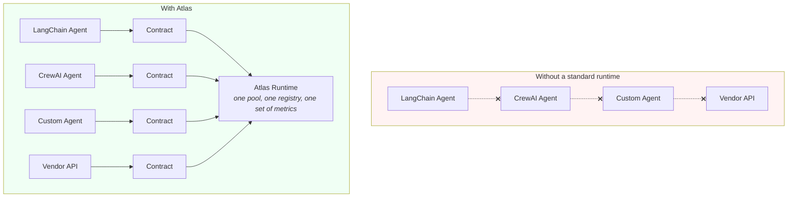
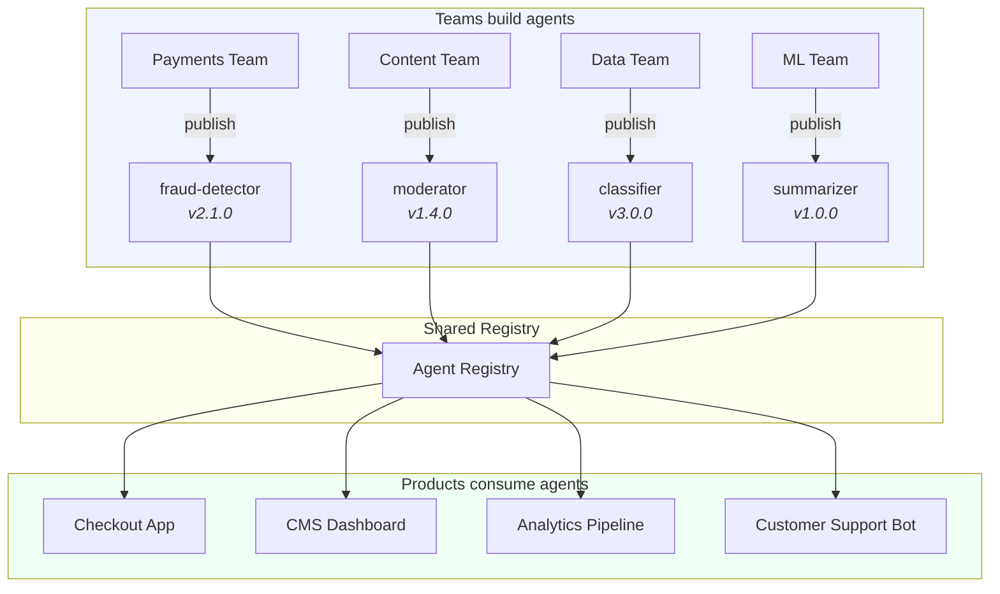

<p align="center">
  <h1 align="center">Atlas</h1>
  <p align="center">
    <strong>The universal runtime for AI agents.</strong>
  </p>
  <p align="center">
    <a href="#the-idea">The Idea</a> ·
    <a href="#what-atlas-does-today">What It Does Today</a> ·
    <a href="#where-its-going">Where It's Going</a> ·
    <a href="#quick-start">Quick Start</a> ·
    <a href="#roadmap">Roadmap</a>
  </p>
</p>

<p align="center">
  
  
  
  
</p>

---

## The Idea

There's no standard way to package, run, and compose AI agents.

You build a LangChain agent. Someone else builds a CrewAI agent. A third team writes raw Python. None of these agents can discover each other, run in the same pool, or chain together without custom glue for every pair. Each one lives inside the application that built it — tightly coupled to its framework, its dependencies, its infrastructure.

Atlas introduces one abstraction that changes this: **the contract**.

A contract is a YAML file that declares what an agent takes in and what it puts out. Typed. Versioned. Framework-agnostic. What's behind the contract — an LLM, a database query, an entire CrewAI crew, a third-party API — doesn't matter. To Atlas, every agent is just a typed function with a name.



This is the same idea that made Docker work for applications, npm for packages, and REST for services — a standard interface that decouples the what from the how.

---

## What Atlas Does Today

Atlas is in active development. Here's what's shipped and working (1045 tests).

### Typed Agent Contracts

Every agent declares a YAML contract with JSON Schema inputs and outputs. The runtime validates data at the boundary — invalid inputs are rejected before execution starts, malformed outputs are caught before reaching consumers.

```yaml
agent:
  name: classifier
  version: "1.2.0"
  capabilities: [classification, nlp]
  input:
    schema:
      type: object
      properties:
        text: { type: string }
        categories: { type: array, items: { type: string } }
      required: [text, categories]
  output:
    schema:
      type: object
      properties:
        category: { type: string }
        confidence: { type: number }
      required: [category, confidence]
```

### Agent Registry with Semver

Discover agents from directories. Resolve by name and semver range. Search by capability.

```python
registry = AgentRegistry(search_paths=["./agents", "./vendor-agents"])
registry.discover()

agent = registry.get("classifier", "^1.0.0")       # latest 1.x.x
agents = registry.search("classification")          # all with this capability
```

### Managed Execution Pool

Bounded concurrency via semaphore. Priority-ordered scheduling — highest priority dequeued first. Warm slot reuse — agents call `on_startup()` once, then handle many jobs without reinitializing. Queue backpressure raises `QueueFullError` at capacity. Graceful shutdown waits for running jobs to complete.

```python
pool = ExecutionPool(
    registry, queue,
    max_concurrent=8,      # max parallel executions
    warm_pool_size=4,      # slots kept alive between jobs
    idle_timeout=300.0,    # evict idle slots after 5 min
)
```

### Chain Composition with Auto-Mediation

Define multi-step agent pipelines in YAML. Atlas mediates data between steps through a strategy cascade — trying the simplest approach first:

1. **Direct** — output matches input schema, pass through
2. **Mapped** — apply `input_map` field mappings from chain definition
3. **Coerce** — automatic type conversion (string ↔ number, scalar wrapping)
4. **LLM Bridge** — semantic transform via LLM when schemas are structurally incompatible

```yaml
chain:
  name: analyze-and-format
  steps:
    - agent: classifier
    - agent: formatter
      input_map:
        content: category
        style: uppercase
```

```python
from atlas.mediation.analyzer import analyze_compatibility

# Pre-check whether two agents can chain
compat = analyze_compatibility(agent_a.output_schema, agent_b.input_schema)
print(compat.strategy)   # "direct", "mapped", "coerce", or "llm_bridge"
```

### Pluggable Orchestrators with Hot-Swap

Routing interceptors that decide what happens to each job — allow, reject (with reason), redirect to a different agent, or override priority. Swap the orchestrator at runtime without restarting.

```python
from atlas.orchestrator.protocol import Orchestrator, RoutingDecision

class TierRouter(Orchestrator):
    async def route(self, job, registry):
        if job.metadata.get("tier") == "premium":
            return RoutingDecision(action="redirect", agent_name="summarizer-gpt4")
        return RoutingDecision(action="redirect", agent_name="summarizer-fast")

    async def on_job_complete(self, job): ...
    async def on_job_failed(self, job): ...

pool.set_orchestrator(TierRouter())  # takes effect on next job
```

### Decoupled Observability

Metrics, traces, eval hooks, retry, and persistence all subscribe to the same EventBus. Add or remove any of them without touching agent code. A failing subscriber doesn't affect execution or other subscribers.

```python
from atlas.metrics import MetricsCollector
from atlas.trace import TraceCollector

MetricsCollector(bus)    # per-agent: latency percentiles, warm hit rate, throughput
TraceCollector(bus)      # per-job: execution time, token counts, cost estimates
```

```python
# Per-job trace
trace = tc.get(job.id)
trace.execution_ms          # wall-clock time
trace.input_tokens           # LLM tokens consumed
trace.estimated_cost_usd    # cost estimate

# Per-agent metrics
m = mc.get_agent_metrics("classifier")
m["latency_p50_ms"]         # 230.5
m["warm_hit_rate"]           # 0.87
m["jobs_by_status"]          # {"completed": 1500, "failed": 12}
```

### Agent Spawning

Agents can spawn child agents during execution — tracked as child jobs with parent references and depth limits.

```python
class DecomposerAgent(AgentBase):
    async def execute(self, input_data: dict) -> dict:
        child = await self.context.spawn("sub-agent", {"chunk": input_data["text"][:1000]})
        return {"result": child.output}
```

### Eval Hooks

Colocate `eval.yaml` with agents. Checks run automatically on every execution and attach results to traces.

```yaml
eval:
  checks:
    - name: confidence_reasonable
      type: range
      field: confidence
      min_val: 0.0
      max_val: 1.0
    - name: category_not_empty
      type: contains
      field: category
```

### Triggers & Scheduling

Submit jobs automatically on a schedule or in response to events. Four trigger types — cron, interval, one-shot, and webhook — with YAML definitions and full CRUD API.

```yaml
# triggers/nightly-cleanup.yaml
trigger:
  name: nightly-cleanup
  trigger_type: cron
  cron_expr: "0 2 * * *"
  agent_name: data-cleaner
  input_data:
    older_than_days: 90
```

```bash
atlas trigger create --type cron --cron "*/5 * * * *" --agent echo --input '{"message":"ping"}'
atlas trigger list
atlas serve --agents ./agents --triggers-path ./triggers
```

Webhooks support optional HMAC-SHA256 signature validation:

```bash
curl -X POST http://localhost:8080/api/hooks/{trigger-id} \
  -H "X-Atlas-Signature: sha256=..." \
  -d '{"event": "deploy"}'
```

### Security & Sandboxing

Agents declare permission scopes and secret requirements in their contracts. The runtime enforces them — no agent can access files, network, or secrets it hasn't declared. Secrets are resolved from environment variables or encrypted files, never hardcoded.

```yaml
agent:
  name: data-processor
  permissions:
    file_system: [read]
    network: [outbound]
  requires:
    secrets: [API_KEY, DB_PASSWORD]
```

```bash
atlas serve --security-policy security.yaml --agents ./agents
```

### Skills & Platform Tools

Agents declare tool dependencies via `requires.skills`. The runtime resolves and injects them at execution time — agents access tools through `context.skill()`. Atlas ships 12 platform tools (`atlas.*`) that expose runtime internals to agents.

```yaml
agent:
  name: orchestrator-agent
  requires:
    platform_tools: true              # inject all atlas.* tools
    skills: [custom-search, embedder] # inject specific skills
```

```python
class Agent(AgentBase):
    async def execute(self, input_data: dict) -> dict:
        agents = await self.context.skill("atlas.registry.list", {})
        result = await self.context.skill("custom-search", {"query": "..."})
        return {"found": result}
```

### MCP Federation

Atlas instances communicate via the [Model Context Protocol](https://modelcontextprotocol.io). One instance's agents and tools are transparently available to another — no custom glue, no shared infrastructure.

```bash
# Instance A: start with MCP server
atlas serve --mcp-port 8400 --auth-token secret

# Instance B: connect to A, federate tools and agents
atlas serve --mcp-port 8401 --remote "lab=http://hostA:8400/mcp@secret"
```

Instance B now has all of A's agents as `lab.*` in its registry. Chains on B can reference `lab.translator` as a step — it executes on A and returns the result transparently.

```yaml
chain:
  name: cross-instance-pipeline
  steps:
    - agent: lab.translator    # runs on Instance A
    - agent: local-formatter   # runs on Instance B
```

### Dynamic Agents — Write Agents in Any Language

Not every agent needs Python. Atlas supports three provider types — all running in the same pool, same chains, same metrics.

**`exec` provider** — run any executable as an agent. JSON on stdin, JSON on stdout. Write agents in Rust, Go, Node, shell scripts — anything that can read and write JSON.

```yaml
# agents/my-rust-agent/agent.yaml
agent:
  name: my-rust-agent
  version: "1.0.0"
  provider:
    type: exec
    command: ["./target/release/my-agent"]
  input:
    schema:
      type: object
      properties:
        message: { type: string }
      required: [message]
  output:
    schema:
      type: object
      properties:
        result: { type: string }
      required: [result]
```

The runtime sends a JSON envelope on stdin (`{input, context, memory}`) and reads JSON from stdout. No Python, no SDK, no boilerplate.

**`llm` provider** — define LLM agents in pure YAML. No code at all. System prompt, model preference, skills as tools — the runtime handles the tool-use loop.

```yaml
# agents/yaml-summarizer/agent.yaml
agent:
  name: yaml-summarizer
  version: "1.0.0"
  provider:
    type: llm
    system_prompt: |
      You are a concise text summarizer. Return a JSON object
      with a "summary" field containing a 1-3 sentence summary.
    output_format: json
    max_iterations: 1
  model:
    preference: fast
  input:
    schema:
      type: object
      properties:
        text: { type: string }
      required: [text]
  output:
    schema:
      type: object
      properties:
        summary: { type: string }
      required: [summary]
```

No `agent.py` needed. Skills declared in `requires.skills` are automatically exposed as tools to the LLM.

**`python` provider** (default) — existing behavior, unchanged. Write an `AgentBase` subclass in `agent.py`.

All three provider types are discovered, registered, and executed identically. Consumers don't know or care which provider is behind a contract.

### Shared Memory

Agents in the pool can learn from each other. Opt in with `requires.memory: true` — all participating agents share a memory pool that persists across executions.

```yaml
agent:
  name: learning-agent
  requires:
    memory: true
```

```python
class Agent(AgentBase):
    async def execute(self, input_data: dict) -> dict:
        # Read what previous agents learned
        memory = await self.context.memory_read()

        # Add your own learnings
        await self.context.memory_append("API rate limit is 100/min")

        return {"result": "..."}
```

For `llm` provider agents, memory is automatically injected into the system prompt and a `memory_append` tool is exposed — no code needed.

For `exec` provider agents, memory arrives in the stdin envelope and writes back via a `_memory_append` key in the output.

File-backed by default (`memory.md`), pluggable via HTTP hook for external systems (Redis, vector DB, etc.).

```bash
# File-backed (default)
atlas serve --agents ./agents --memory memory.md

# HTTP hook for external memory
atlas serve --agents ./agents --memory-url http://localhost:9000/memory
```

### Retry, Persistence, and Recovery

Failed jobs auto-retry with configurable backoff. Jobs persist to SQLite and survive crashes — pending jobs reload on restart.

```python
recovered = await queue.load_pending()  # picks up where it left off
```

### HTTP API, WebSocket, and CLI

```bash
atlas discover ./agents                     # scan and list contracts
atlas run classifier '{"text": "...", "categories": ["a","b"]}'
atlas serve --agents ./agents --db atlas.db  # start HTTP + WS server
atlas orchestrator set cost-router           # swap routing at runtime
```

| Endpoint | Description |
|---|---|
| `POST /api/jobs` | Submit a job |
| `GET /api/jobs/{id}` | Job status and result |
| `GET /api/agents` | Discovered agents |
| `GET /api/metrics` | Pool and per-agent metrics |
| `GET /api/traces` | Execution traces |
| `POST /api/orchestrator` | Swap routing policy |
| `POST /api/triggers` | Create a trigger |
| `GET /api/triggers` | List triggers |
| `POST /api/triggers/{id}/fire` | Manually fire a trigger |
| `POST /api/hooks/{id}` | Webhook receiver |
| `WS /ws` | Live job status stream |

For the full technical deep-dive — internal diagrams, module map, ordering guarantees, warm slot lifecycle — see **[Architecture](docs/ARCHITECTURE.md)**.

---

## Where It's Going

The contract abstraction is the foundation. Here's what it unlocks as Atlas matures.

### Contain agents from any framework

Wrap agents built with LangChain, CrewAI, OpenClaw, or anything else in Atlas contracts. They run in the same pool, compose in the same chains, and appear in the same registry — regardless of what's inside.

```python
# A CrewAI crew behind an Atlas contract
class Agent(AgentBase):
    async def on_startup(self):
        self.crew = build_my_crewai_crew()

    async def execute(self, input_data: dict) -> dict:
        result = await self.crew.kickoff(input_data)
        return {"analysis": result.output}
```

The consumer doesn't know or care what's underneath. They see a contract. They submit a job. They get a typed result.

### Shared agent pool across a company

Every team builds agents for their domain. All of them publish contracts to a shared registry. Every product discovers and uses any agent without importing code, managing dependencies, or standing up separate infrastructure.



Teams own their agents. Products compose them freely. One pool handles concurrency, priority, cost tracking, and routing.

### Ship agents like APIs

Domain experts publish agents the same way they'd ship an API — the contract is the interface, the implementation stays private. Versioned with semver. Pin consumers to ranges. Ship updates without breaking anyone.

```yaml
# What you publish — the contract
agent:
  name: legal-doc-analyzer
  version: "2.1.0"
  capabilities: [legal-analysis, risk-assessment, compliance]
  input:
    schema: { ... }
  output:
    schema: { ... }

# What stays private: the implementation, model weights, prompts, training data
```

### Chain agents across infrastructure

An on-prem extraction agent feeds a cloud LLM agent feeds an internal formatter. They don't share code, dependencies, or infrastructure. They share contracts — Atlas mediates the data between them.

```yaml
chain:
  name: cross-infra-pipeline
  steps:
    - agent: on-prem/extractor
    - agent: cloud/summarizer
      input_map: { text: extracted_data }
    - agent: internal/formatter
      input_map: { content: summary, style: markdown }
```

### Schedule anything

Submit work to the pool and let it run — classification sweeps, nightly cleanups, research tasks, batch processing, periodic audits. Jobs are persistent, priority-ordered, and recoverable after crashes.

```python
# Background cleanup — low priority
for table in stale_tables:
    await pool.submit(JobData(
        agent_name="data-cleaner",
        input_data={"table": table, "older_than_days": 90},
        priority=0,
    ))

# Urgent fraud check — jumps the queue
await pool.submit(JobData(
    agent_name="fraud-detector",
    input_data={"transaction_id": txn.id},
    priority=10,
))
```

---

## Quick Start

```bash
pip install atlas
```

### Define and run an agent

```yaml
# agents/echo/agent.yaml
agent:
  name: echo
  version: "1.0.0"
  input:
    schema:
      type: object
      properties:
        message: { type: string }
      required: [message]
  output:
    schema:
      type: object
      properties:
        message: { type: string }
      required: [message]
```

```python
# agents/echo/agent.py
from atlas.runtime.base import AgentBase

class Agent(AgentBase):
    async def execute(self, input_data: dict) -> dict:
        return {"message": input_data["message"]}
```

```bash
atlas discover ./agents
atlas run echo '{"message": "hello"}'
```

### Or skip Python entirely

```yaml
# agents/greeter/agent.yaml — no agent.py needed
agent:
  name: greeter
  version: "1.0.0"
  provider:
    type: llm
    system_prompt: "You are a friendly greeter. Return {\"greeting\": \"...\"}"
    output_format: json
  model:
    preference: fast
  input:
    schema:
      type: object
      properties:
        name: { type: string }
      required: [name]
  output:
    schema:
      type: object
      properties:
        greeting: { type: string }
      required: [greeting]
```

```bash
atlas run greeter '{"name": "world"}'
# {"greeting": "Hello, world! Welcome!"}
```

### Submit to a pool

```python
from atlas.contract.registry import AgentRegistry
from atlas.events import EventBus
from atlas.pool.executor import ExecutionPool
from atlas.pool.job import JobData
from atlas.pool.queue import JobQueue

registry = AgentRegistry(search_paths=["./agents"])
registry.discover()

bus = EventBus()
queue = JobQueue(max_size=100, event_bus=bus)
pool = ExecutionPool(registry, queue, max_concurrent=8, warm_pool_size=4)
await pool.start()

job = JobData(agent_name="echo", input_data={"message": "hello"})
await pool.submit(job)
result = await queue.wait_for_terminal(job.id, timeout=10.0)
# result.output_data == {"message": "hello"}
```

---

## Roadmap

### Shipped

| Phase | What |
|---|---|
| 1 | **Contracts & Registry** — YAML contracts, schema validation, semver, capability search |
| 2 | **Execution Pool** — priority queue, warm slots, concurrency, graceful shutdown |
| 3 | **Chain Composition** — multi-step chains, mediation engine, async executor |
| 4 | **Mediation Engine** — direct / mapped / coerce / LLM bridge strategies |
| 5 | **Monitoring** — traces, token tracking, cost estimation, eval hooks |
| 6 | **Orchestrator Override** — pluggable routing, hot-swap, reject/redirect |
| 7 | **Triggers & Scheduling** — cron, interval, one-shot, webhooks with HMAC, trigger CRUD API |
| 8 | **Security & Sandboxing** — permission scopes, resource limits, network policies, secret injection |
| 9 | **Skills & Tool Use** — skill registry, resolver, platform tools (12 `atlas.*` tools), skill injection into agents |
| 10A | **MCP Server** — Streamable HTTP + SSE transport, bearer token auth middleware, health endpoint |
| 10B | **MCP Client** — remote tool federation, `RemoteToolProvider`, namespaced skill registration |
| 10C | **Federated Chains** — `RemoteAgentProvider`, virtual agents in registry, `atlas.exec.run`, skill injection in chains |
| 11 | **Dynamic Agents & Shared Memory** — exec provider (any language), llm provider (YAML-only), pluggable shared memory (file/HTTP) |

### Next

| Phase | What |
|---|---|
| 12 | **Hardware Scheduling** — GPU/memory-aware slots, heterogeneous pools, resource reservation |
| 13 | **Agent Marketplace** — remote registries, agent publishing, cross-registry dependency resolution |

---

## Learn More

- **[Architecture](docs/ARCHITECTURE.md)** — technical deep-dive, diagrams, module map
- **[Contributing](CONTRIBUTING.md)** — development setup, testing, how to add agents
- **[Example agents](agents/)** — 19 reference implementations (Python, exec, YAML-only LLM)
- **[Example chains](chains/)** — multi-step pipeline definitions
- **[Example triggers](triggers/)** — cron and webhook trigger definitions

## Requirements

- Python 3.11+
- No external services — runs with Python agents and SQLite
- Optional: `anthropic`, `openai`, or `langchain` for LLM-powered agents

## License

[MIT](LICENSE)
