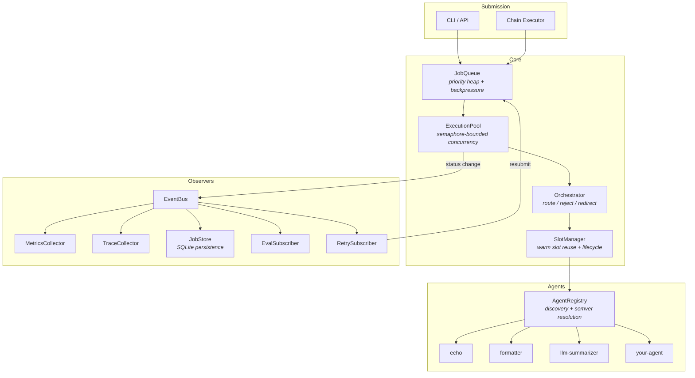
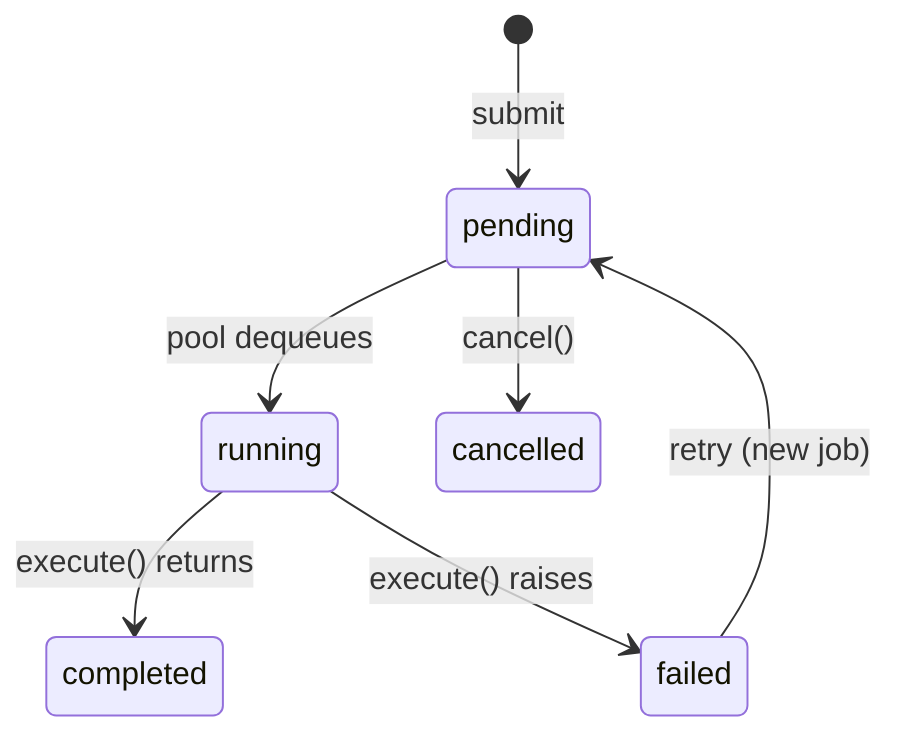
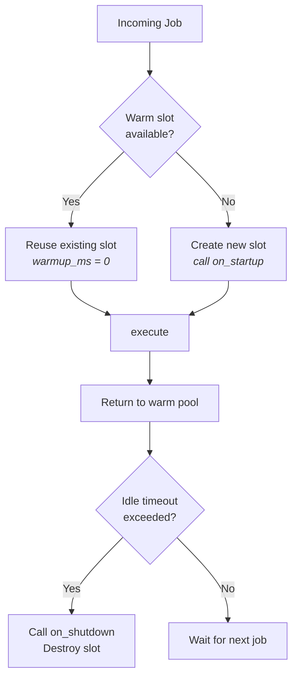
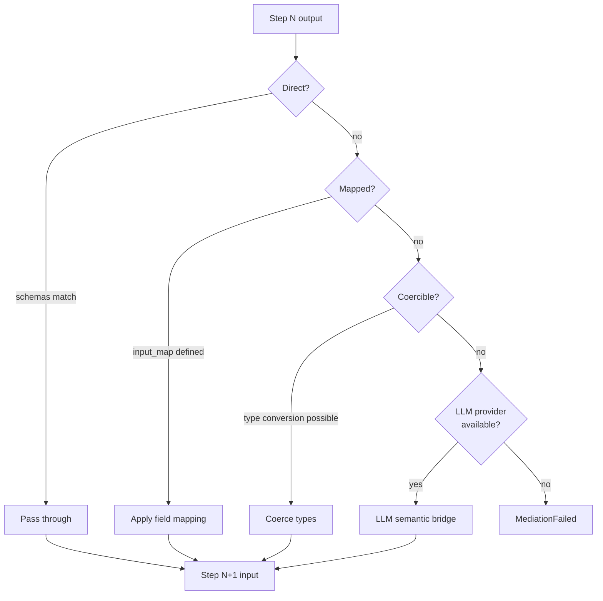

# Architecture

Deep dive into how Atlas works internally. For the high-level overview and motivation, see the [README](../README.md).

---

## System Overview



---

## Job Lifecycle

Every job follows a deterministic state machine. Status transitions emit events to all EventBus subscribers **before** waiters are notified — guaranteeing that traces, metrics, and store are consistent when `wait_for_terminal` returns.



### Ordering Guarantee

When a job reaches a terminal state, the queue processes side effects in strict order:

1. **Store save** — persist updated job to SQLite
2. **EventBus emit** — all subscribers process the event (metrics, traces, eval, retry)
3. **Waiter signal** — `wait_for_terminal()` callers are unblocked

This means any code that awaits `wait_for_terminal` is guaranteed that the store, metrics, and traces are already populated.

---

## Execution Pool

### Concurrency Model

The pool uses an `asyncio.Semaphore` to bound concurrent executions. When a job is dequeued:

1. Acquire semaphore (blocks if at `max_concurrent`)
2. Route through orchestrator (allow / reject / redirect)
3. Acquire or create a warm slot via SlotManager
4. Validate input against contract schema
5. Execute agent's `execute()` method
6. Validate output against contract schema
7. Update job status → triggers EventBus cascade
8. Release semaphore

### Warm Slot Reuse



Agents call `on_startup()` once when a slot is created (load models, open connections). The slot persists across multiple jobs. After `idle_timeout`, the slot is evicted and `on_shutdown()` is called.

The `warm_pool_size` parameter controls how many slots are kept alive. First job to an agent is a cold start; subsequent jobs reuse the warm slot.

---

## Chain Mediation

When chaining agents with different I/O schemas, the MediationEngine bridges them automatically by trying strategies in order of simplicity:



### Strategy Details

| Strategy | When Used | Example |
|---|---|---|
| **Direct** | Output schema is a superset of input schema | `{text, score}` → `{text}` |
| **Mapped** | Chain definition includes `input_map` | `content: summary` maps field names |
| **Coerce** | Types differ but are convertible | `"42"` → `42`, scalar → `{value: scalar}` |
| **LLM Bridge** | Schemas are semantically related but structurally incompatible | Free-text summary → structured JSON |

### Compatibility Analysis

Before running a chain, you can analyze compatibility between steps:

```python
from atlas.mediation.analyzer import analyze_compatibility

compat = analyze_compatibility(agent_a.output_schema, agent_b.input_schema)
# Returns: compatible (bool), strategy (str), field_mapping (dict), warnings (list)
```

---

## Orchestrator Pipeline

Orchestrators sit between the queue and execution. They implement a simple protocol:

```python
class Orchestrator(Protocol):
    async def route(self, job: JobData, registry: AgentRegistry) -> RoutingDecision: ...
    async def on_job_complete(self, job: JobData) -> None: ...
    async def on_job_failed(self, job: JobData) -> None: ...
```

### Routing Decisions

| Action | Effect |
|---|---|
| `allow` | Execute as-is |
| `reject` | Fail the job immediately with a reason |
| `redirect` | Change the target agent (e.g., echo → formatter) |
| `allow` + `priority` | Override the job's priority |

### Hot-Swap

Orchestrators can be swapped at runtime via `pool.set_orchestrator()` or the `POST /api/orchestrator` endpoint. The new orchestrator takes effect on the next job dequeued — no restart, no downtime.

---

## EventBus

The EventBus is a simple pub/sub system for job status transitions. Subscribers are async callables:

```python
async def callback(job: JobData, old_status: str, new_status: str) -> None: ...
```

### Subscriber Isolation

- Each subscriber runs independently — a failure in one does not affect others
- Exceptions are logged with full tracebacks but swallowed
- Subscribers are called sequentially per event (not parallel)

### Built-in Subscribers

| Subscriber | Purpose |
|---|---|
| `MetricsCollector` | Latency percentiles, warm hit rate, status counts per agent |
| `TraceCollector` | Per-job execution traces with token counts and cost estimates |
| `JobStore` | Persistence to SQLite (via queue) |
| `EvalSubscriber` | Runs YAML eval checks on completed jobs, attaches results to traces |
| `RetrySubscriber` | Resubmits failed jobs based on agent retry config |

---

## Agent Registry

### Discovery

The registry scans directories for `agent.yaml` files, validates contracts, and loads agent implementations:

```
agents/
├── echo/
│   ├── agent.yaml    # contract (name, schemas, capabilities)
│   └── agent.py      # implementation (class Agent(AgentBase))
├── formatter/
│   ├── agent.yaml
│   └── agent.py
└── summarizer/
    ├── agent.yaml
    ├── agent.py
    └── eval.yaml     # optional eval checks
```

### Semver Resolution

Agents are versioned. The registry supports semver range queries:

```python
registry.get("summarizer", "^1.0.0")  # latest 1.x.x
registry.get("summarizer", "~1.2.0")  # latest 1.2.x
registry.get("summarizer")            # latest version
```

### Capability Search

Agents declare capabilities in their contract. The registry supports capability-based lookup:

```python
agents = registry.search("text-processing")  # all agents with this capability
```

---

## LLM Provider Abstraction

Atlas abstracts LLM providers behind a common interface:

```python
class LLMProvider(Protocol):
    async def complete(self, prompt: str, **kwargs) -> LLMResponse: ...
```

Built-in providers:
- `AnthropicProvider` — Claude models via the Anthropic SDK
- `OpenAIProvider` — GPT models via the OpenAI SDK
- `LangChainProvider` — any LangChain-compatible model

Token counts and model name flow back through `LLMResponse` → `AgentContext.execution_metadata` → job metadata → `ExecutionTrace`.

---

## Triggers & Scheduling

The trigger system submits jobs to the pool on a schedule or in response to events.

### Trigger Types

| Type | Fires When | Schedule Field |
|---|---|---|
| `cron` | Cron expression matches | `cron_expr` (5-field) |
| `interval` | Every N seconds | `interval_seconds` |
| `one_shot` | Once at a specific time, then disables | `fire_at` (unix timestamp) |
| `webhook` | HTTP request hits `/api/hooks/{id}` | N/A (event-driven) |

### Scheduler

The `TriggerScheduler` runs as an async background task, polling the `TriggerStore` every `poll_interval` seconds for due triggers. When a trigger fires:

1. Create a `JobData` from the trigger's `agent_name`, `input_data`, and `priority`
2. Submit to the pool via `pool.submit()`
3. Update trigger state: `last_fired`, `fire_count`, `last_job_id`
4. Compute `next_fire` for recurring triggers; disable one-shot triggers
5. Save updated trigger to store

Webhook triggers bypass the polling loop — they fire immediately via `fire_webhook()` when an HTTP request arrives.

### Webhook Security

Webhook triggers support optional HMAC-SHA256 signature validation. If `webhook_secret` is set, the endpoint validates the `X-Atlas-Signature` header against the request body before firing.

---

## MCP Federation

Atlas instances communicate via the [Model Context Protocol](https://modelcontextprotocol.io). Federation has three layers:

### Layer 1: MCP Server (Phase 10A)

Every Atlas instance can expose its skills as MCP tools over HTTP:

```
atlas serve --mcp-port 8400 --auth-token secret
```

The MCP server uses Streamable HTTP transport with optional bearer token auth. The `/health` endpoint is always open. SSE transport is supported for legacy clients.

### Layer 2: Remote Tool Federation (Phase 10B)

`RemoteToolProvider` connects to a remote MCP server, discovers its tools, and registers them as local skills with a namespace prefix:

```
atlas serve --remote "lab=http://host:8400/mcp@secret"
```

Remote tools appear as `lab.tool-name` in the local skill registry. Agents declare them as dependencies via `requires.skills: ["lab.tool-name"]` and call them via `context.skill()`.

### Layer 3: Federated Chains (Phase 10C)

`RemoteAgentProvider` discovers remote agents (via `atlas.registry.list` / `atlas.registry.describe`) and registers them as virtual agents in the local `AgentRegistry`. Each virtual agent's `execute()` calls `atlas.exec.run` on the remote instance.

Chains reference remote agents directly — no wrapper code needed:

```yaml
chain:
  name: cross-instance
  steps:
    - agent: lab.translator    # executes on remote instance
    - agent: local-formatter   # executes locally
```

The `ChainRunner` resolves and injects skills for each step via an optional `SkillResolver`, matching the same injection path used by the `ExecutionPool`.

---

## Skills & Platform Tools

### Skill System

Skills are named async callables with typed I/O schemas. Agents declare dependencies via `requires.skills` in their contract, and the runtime injects them at execution time.

```
Agent contract (requires.skills: ["embedder"]) → SkillResolver → SkillRegistry → callable injected into AgentContext._skills
```

### Platform Tools (12 tools)

| Tool | Description |
|---|---|
| `atlas.registry.list` | List registered agents |
| `atlas.registry.describe` | Describe an agent's contract |
| `atlas.registry.search` | Search agents by capability |
| `atlas.exec.run` | Execute an agent synchronously (federation primitive) |
| `atlas.exec.spawn` | Submit a job to the pool |
| `atlas.exec.status` | Get a job's status |
| `atlas.exec.cancel` | Cancel a pending job |
| `atlas.queue.inspect` | Inspect the job queue |
| `atlas.monitor.health` | Pool health stats |
| `atlas.monitor.metrics` | Per-agent metrics |
| `atlas.monitor.trace` | Get a single trace |
| `atlas.monitor.traces` | List execution traces |

Agents opt in via `requires.platform_tools: true`.

---

## Module Map

```
atlas/
├── contract/
│   ├── registry.py      # AgentRegistry — discovery, semver, virtual agents
│   ├── schema.py        # JSON Schema validation (validate_input, validate_output)
│   ├── types.py         # AgentContract, SchemaSpec, RequiresSpec, PermissionsSpec
│   └── permissions.py   # PermissionsSpec — file, network, subprocess, env scopes
├── pool/
│   ├── executor.py      # ExecutionPool — concurrency, warm slots, skill injection
│   ├── job.py           # JobData — job record with status, timing, metadata
│   ├── queue.py         # JobQueue — priority heap, backpressure, persistence
│   └── slot_manager.py  # SlotManager — warm slot lifecycle (create/reuse/evict)
├── chains/
│   ├── definition.py    # ChainDefinition, ChainStep — YAML chain specs
│   ├── runner.py        # ChainRunner — mediation + optional skill injection
│   └── executor.py      # ChainExecutor — async chain execution with status tracking
├── orchestrator/
│   ├── protocol.py      # Orchestrator protocol + RoutingDecision
│   └── default.py       # DefaultOrchestrator (allow-all)
├── mediation/
│   ├── engine.py        # MediationEngine — strategy cascade
│   ├── strategies.py    # Direct, Mapped, Coerce, LLMBridge strategies
│   └── analyzer.py      # Compatibility analysis between schemas
├── runtime/
│   ├── base.py          # AgentBase — abstract base class for all agents
│   ├── context.py       # AgentContext — spawn, skills, chain data
│   ├── runner.py        # run_agent() — standalone agent execution
│   └── llm_agent.py     # LLMAgent — base class for LLM-powered agents
├── skills/
│   ├── registry.py      # SkillRegistry — discovery + RegisteredSkill entries
│   ├── resolver.py      # SkillResolver — resolve skill names to callables
│   ├── platform.py      # PlatformToolProvider — 12 atlas.* platform tools
│   ├── schema.py        # YAML loading + validation for skill.yaml
│   └── types.py         # SkillSpec, SkillCallable, SkillError
├── mcp/
│   ├── server.py        # create_mcp_server() — wraps SkillRegistry as MCP tools
│   ├── transport.py     # ASGI app — Streamable HTTP + SSE + health endpoint
│   ├── auth.py          # BearerAuthMiddleware — timing-safe token validation
│   ├── client.py        # RemoteToolProvider — connect to remote MCP, register skills
│   ├── remote_agents.py # RemoteAgentProvider — virtual agents for federation
│   └── stdio.py         # stdio transport for MCP
├── security/
│   ├── policy.py        # SecurityPolicy — YAML-defined permission + secret rules
│   └── secrets.py       # SecretResolver, EnvSecretProvider, FileSecretProvider
├── llm/
│   ├── provider.py      # LLMProvider protocol + LLMResponse
│   ├── anthropic.py     # AnthropicProvider
│   └── openai.py        # OpenAIProvider
├── triggers/
│   ├── models.py        # TriggerDefinition — cron, interval, one_shot, webhook
│   ├── cron.py          # CronExpr — lightweight 5-field cron parser
│   ├── scheduler.py     # TriggerScheduler — async tick loop, fires due triggers
│   └── routes.py        # HTTP routes for trigger CRUD + webhook endpoint
├── store/
│   ├── job_store.py     # JobStore — SQLite persistence via aiosqlite
│   └── trigger_store.py # TriggerStore — SQLite persistence for triggers
├── cli/
│   ├── app.py           # Typer CLI — run, serve, mcp, list, inspect, validate
│   ├── pool_commands.py # discover, run, serve commands
│   ├── orchestrator_commands.py # orchestrator list/set/reset
│   ├── trigger_commands.py # trigger create/list/get/delete/enable/disable
│   ├── security_commands.py # security policy validation
│   ├── skill_commands.py    # skill list/inspect
│   └── formatting.py    # Table and output formatting
├── events.py            # EventBus — subscriber-isolated pub/sub
├── metrics.py           # MetricsCollector — latency, throughput, warm hits
├── trace.py             # TraceCollector + ExecutionTrace + cost estimation
├── eval.py              # EvalRunner + EvalSubscriber + YAML eval definitions
├── retry.py             # RetrySubscriber — backoff + resubmit
├── serve.py             # aiohttp HTTP server
└── ws.py                # WebSocket event streaming
```
